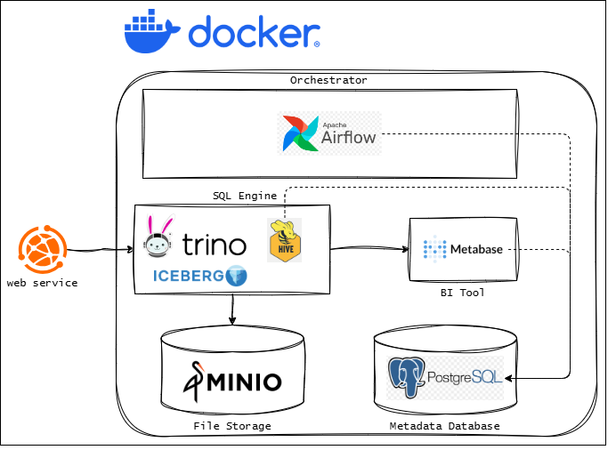
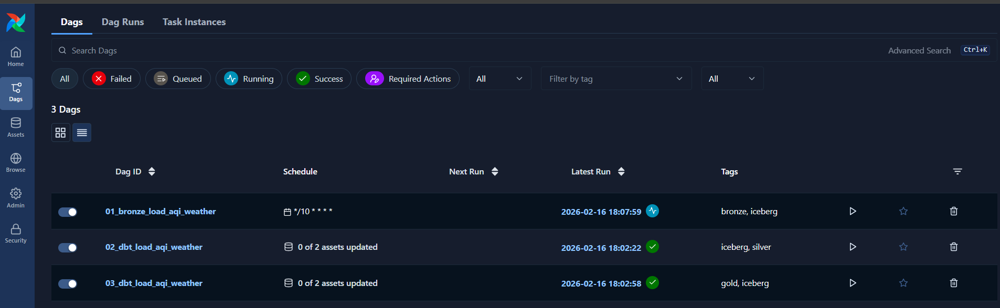
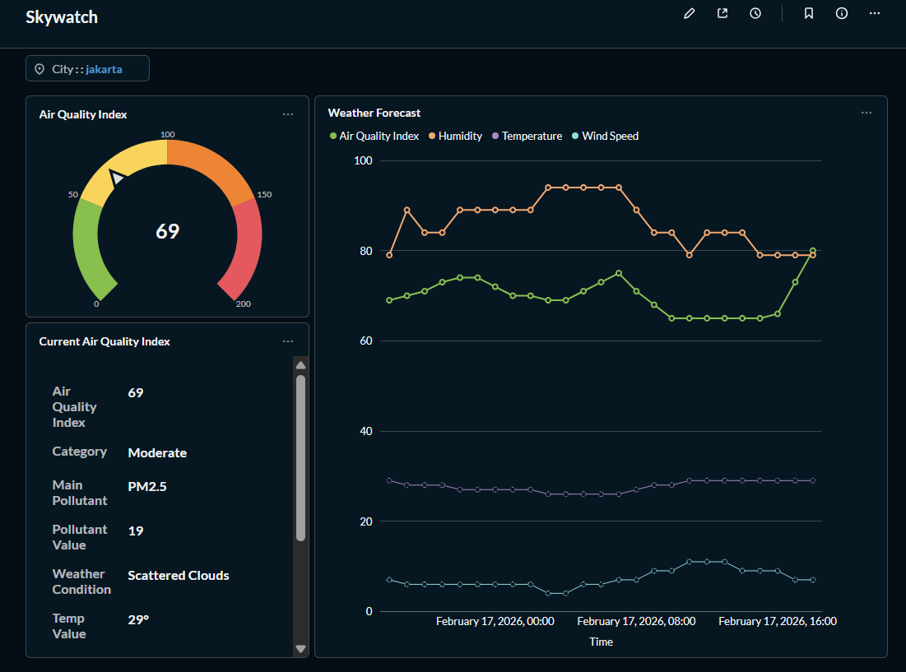
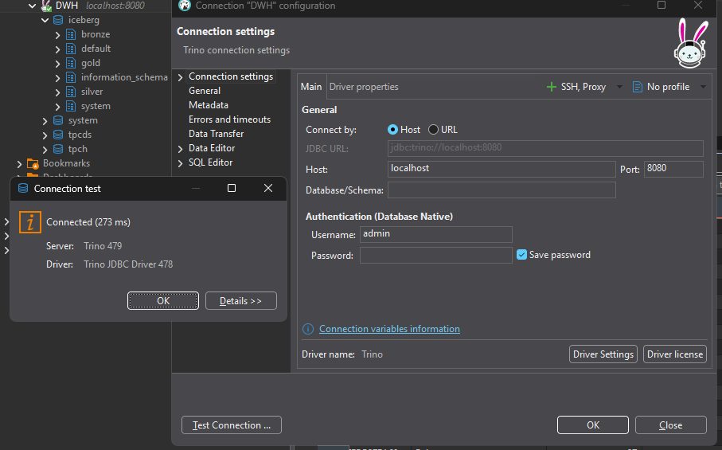
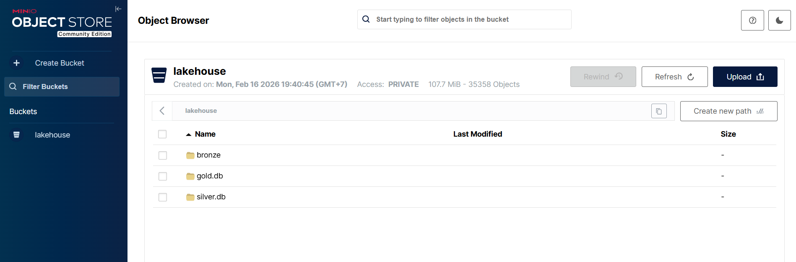

# Indonesia Air Quality & Weather Monitoring System

An automated air quality monitoring and weather forecasting system for major cities in Indonesia, built using a Modern Data Stack architecture.

## 1. Project Overview & Problem Statement

### **Problem**

Air quality and weather patterns in Indonesia have recently become highly volatile. The emergence of extreme weather phenomena—such as flash floods, landslides, and hazardous air pollution levels—demands a reliable, continuous monitoring system.

### **Goals**

This project aims to build an automated data pipeline to monitor the Air Quality Index (AQI) and Weather Forecasts via batch processing across multiple regions in Indonesia.

### **Data Source**

Data is obtained through web scraping from [IQAir Indonesia](https://www.iqair.com/indonesia).

---

## 2. Tech Stack & Environment



The project is fully containerized using Docker to ensure scalability and easy replication of the local environment.

| Komponen           | Tech               | Desc                                                             |
| :----------------- | :----------------- | :--------------------------------------------------------------- |
| **Orchestrator**   | **Apache Airflow** | Schedules and manages pipeline execution (Bronze, Silver, Gold). |
| **Query Engine**   | **Trino**          | SQL engine for high-speed processing of Data Lake data.          |
| **Object Storage** | **Minio**          | Primary S3-compatible storage for data files.                    |
| **Data Catalog**   | **Hive Metastore** | Manages table metadata for Trino & Iceberg integration.          |
| **Table Format**   | **Apache Iceberg** | Supports ACID transactions and time travel in the Data Lake.     |
| **BI Tools**       | **Metabase**       | Dashboard visualization and air quality monitoring.              |
| **Database**       | **Postgres**       | Metadata database for Airflow, Hive, and Metabase.               |
| **Transform**      | **dbt**            | Data transformation using SQL and Python.                        |

---

## 3. Data Flow Architecture

A **data pipeline** is a series of data processing steps that move data from source systems to a destination, such as a data warehouse or data lake. The pipeline typically includes stages for data ingestion, transformation, and loading (ETL). In this project, we have implemented a data pipeline that extracts air quality and weather forecast data from a web source, processes it, and stores it in a structured format for analysis and visualization.

## 4. Data Ingestion (Bronze Layer) [`load_bronze`](./airflow/dags/01_bronze_load_aqi_weather.py)

The Bronze Layer ingestion extracts raw data from two primary objects via scraping. The pipeline runs automatically every 10 minutes via the DAG: [`load_bronze`](./airflow/dags/01_bronze_load_aqi_weather.py).

1. **Data Air Quality Index**

   Stores current air quality and actual weather conditions at the time of ingestion.

   | Kategori      | Kolom                                      | Deskripsi                                    |
   | :------------ | :----------------------------------------- | :------------------------------------------- |
   | **Geo**       | `province`, `city`                         | Administrative location (Province and City). |
   | **Pollution** | `aqi`, `aqi_status`                        | Air Quality Index value and its category.    |
   |               | `main_pollutant`, `concentration`          | Dominant pollutant and concentration value.  |
   | **Weather**   | `weather`, `temperature`                   | General weather conditions and temperature.  |
   |               | `humidity`, `wind_speed`, `wind_direction` | Humidity, wind speed, and wind direction.    |
   | **Metadata**  | `alert`                                    | Early warnings regarding air quality.        |
   |               | `observation_ts`                           | Original observation time from the source.   |
   |               | `scraped_ts`                               | Timestamp of data ingestion.                 |

2. **Data Weather Forecast**

   Stores weather and air quality forecasts for future periods.

   | Kategori      | Kolom                     | Deskripsi                                    |
   | :------------ | :------------------------ | :------------------------------------------- |
   | **Geografis** | `province`, `city`        | Administrative location (Province and City). |
   | **Prediksi**  | `forecast_ts`             | Target timestamp for the prediction.         |
   |               | `aqi`, `weather`          | Predicted AQI value and weather condition.   |
   | **Parameter** | `temperature`, `humidity` | Predicted temperature and humidity.          |
   |               | `wind_speed`              | Predicted wind speed.                        |
   | **Metadata**  | `observation_time`        | Original observation time from the source.   |
   |               | `scraped_at`              | Timestamp of data ingestion                  |

> ### 💡 Note
>
> Data in the Bronze Layer is stored in raw format to maintain data integrity before moving to the Silver Layer. The scraper runs every 10 minutes to ensure data freshness. **Silver Layer**.

---

## **5. Data Transformation** (Silver Layer) [`load_staging`](./airflow/dags/02_dbt_load_aqi_weather.py)

This is where messy, raw data (Bronze) is transformed into clean, structured, and validated data that is ready for analytical modeling.

For this project, I implemented two primary dbt models: [**aqi_index**](./airflow/dbt/skywatch_transform/models/silver/aqi_index.sql) and [**weather_forecast**](./airflow/dbt/skywatch_transform/models/silver/weather_forecast.sql). Below are the technical highlights of the transformation process:

1. **Apache Iceberg**

   Both models leverage the Apache Iceberg table format to provide enterprise-grade features on a Data Lake:

   Optimal Partitioning: Data is partitioned by city and day(ts). This enables Partition Pruning, ensuring that dashboard queries don't scan the entire storage (MinIO) but only read the relevant files.

   Sorted Storage: By using the sorted_by property on event_ts, the storage is optimized for time-series analysis, significantly speeding up trend visualization.

   Incremental Merge Strategy: Instead of rebuilding the entire table, dbt identifies new data and performs an Upsert. If a record with a matching ID exists, it updates; otherwise, it inserts. This makes the pipeline highly cost-efficient.

2. **Data Cleansing & Casting**

   Since web-scraped data often arrives as messy strings, I applied rigorous transformations to ensure data integrity:

   Regex Feature Extraction: I used regexp_replace to strip non-numeric characters (like degree symbols °, units km/h, or %). This converts raw text into proper DOUBLE and INTEGER types for mathematical computation.

   Complex Date Parsing: I handled varied observation time formats by reconstructing them into standardized TIMESTAMP objects (ISO 8601), ensuring a unified timeline across the system.

   Normalization: Using LOWER(TRIM()) on geographic columns (Province/City) prevents data fragmentation caused by inconsistent casing or trailing spaces.

3. **Deduplication**

   With a 10-minute scraping interval, data overlap is inevitable. I mitigated this using a two-layered defense:

   Deterministic Unique IDs: A Primary Key is generated via an MD5 Hash of the composite key (city + timestamp). This ensures that a specific observation at a specific location has one, and only one, unique ID.

   Window Function Logic: Using ROW_NUMBER() OVER (PARTITION BY ... ORDER BY scraped_ts DESC), the model identifies duplicate entries and selects only the latest version (rn=1) of the truth.

---

## Data Modeling (Gold Layer)[`load_gold`](./airflow/dags/03_dbt_load_aqi_weather.py)

The Gold Layer is the final destination in our Medallion Architecture. This layer transforms the cleaned Silver data into a specialized Star Schema, designed specifically for high-performance analytics, reporting, and visualization in Metabase.

1. **The Star Schema Design**

   To ensure optimal query performance, the data is modeled into a Star Schema consisting of one central Fact Table and three supporting Dimension Tables.

   **_The Fact Table_**

   fact_aqi_weather: The centerpiece of the model. It unifies actual observations with forecasted data, providing a single source of truth for both historical and predictive analysis.

   **_The Dimension Tables_**

   dim_city: Contains geographical master data (City, Province, Country).

   dim_aqi: A reference table for Air Quality Index thresholds, mapping values to health categories (e.g., Good, Moderate, Unhealthy).

   dim_date: A rich temporal dimension that breaks down time into year, month, day, hour, semester, and weekend flags.

2. **Model Breakdown**

   **_Dim City & Dim AQI_** (SCD Type 1)
   These models use an Incremental Merge strategy to track audit metadata:

   created_at: Captured when a city or AQI category is first encountered.

   updated_at: Refreshed every time the pipeline runs to ensure the latest status is captured.

   Hashing: IDs are generated using deterministic MD5 hashes for consistent joining across layers.

   **_Dim Date (The Calendar Engine)_**
   Unlike the others, dim_date is materialized as a Table to ensure flags like is_current_day, is_current_month, and is_current_year are refreshed based on the Asia/Jakarta timezone during every run.

   **_Fact AQI Weather (The Data Core)_**
   Full Outer Join: Combines aqi_index and weather_forecast to fill gaps where one source might be missing data for a specific timestamp.

   Coalesce Logic: Prioritizes forecast data for future timestamps and actual data for past timestamps to provide a seamless timeline.

   Deduplication: Uses ROW_NUMBER() to ensure only the most recent scrape for any city/timestamp combination makes it into the final model.

---

## How to Re-Populate

1. **Clone Repository:**

   ```bash
   git clone https://github.com/oillypump/skywatch.git
   cd skywatch
   ```

2. **start services**

   it took a while to pull and build all image, so please be patient, depends on your internet connection and computer spec, it can take around 5-15 minutes to pull and build all image.
   this airflow assume local linux user id : 1000. if your user use another id please make it sure you use the same user id.

   ```bash
   docker compose pull && docker compose build --no-cache
   chmod -R 775 airflow/
   docker compose run airflow-cli airflow config list
   docker compose up airflow-init
   docker compose up -d
   ```

3. **Airflow Setup**

   Login to Airflow UI (http://localhost:8181), enable, and trigger the following DAGs:
   - [`01_bronze_load_aqi_weather`](./airflow/dags/01_bronze_load_aqi_weather.py) Start data ingestion.
   - [`02_dbt_load_aqi_weather`](./airflow/dags/02_dbt_load_aqi_weather.py) Transform data to Silver.
   - [`03_dbt_load_aqi_weather`](./airflow/dags/03_dbt_load_aqi_weather.py) Model data to Gold.

   Credentials: airflowuser / airflowuser

   example Airflow UI:

   

4. **Monitoring Metabase/Trino/MinIO**
   - Metabase Dashboard: http://localhost:3000 (admin@email.com / Admin1234)

   
   - Trino (DBeaver): http://localhost:8080 (User: admin)

   
   - MinIO Browser: http://localhost:9001 (minioadmin / minioadmin)

   

---

## How to remove all image, container, volume, network

```
docker compose down -v --remove-orphans --rmi all
```

## Appendix

### project tree

[Project tree](./project-tree.md)

### project hash 8aeaaf009dda8089d406b7f6ebed399b42a0a135

```
8aeaaf009dda8089d406b7f6ebed399b42a0a135
```
